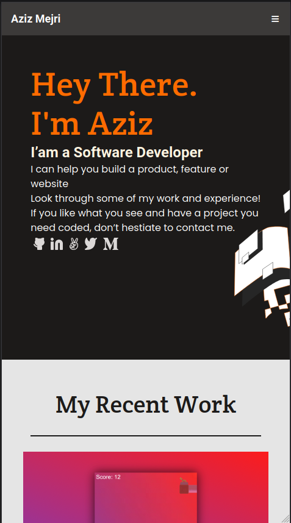

# Portfolio-Project

> Portfolio-Project

This project has been created within the frames of the Microverse curriculum for the purpose of creating personal portfolio website.

## Built With

- HTML/CSS

## Live Demo

Pending

## Getting Started

To get a local copy up and running follow these simple example steps.

## Setup

### Step 1:
- Copy the link of this repo by clicking the green button - "code" on the right-top corner
- Clone this repo locally by running the following command in your terminal:

  `git clone git@github.com:Hope1226/portfolio-cr-trails.git`

### Step 2:
- Run `index.html` file in your browser
- Open the borwser tool-box 
- Switch to Mobile view mode.

## Authors

👤 **Hope**

- GitHub: [@Hope1226](https://github.com/Hope1226)
- LinkedIn: [LinkedIn](https://www.linkedin.com/in/umidjon-ustabaev/)

## 🤝 Contributing

Contributions, issues, and feature requests are welcome!

Feel free to check the [issues page](../../issues/).

## Show your support

Give a ⭐️ if you like this project!

## Acknowledgments

- Hat tip to anyone whose code was used
- Inspiration
- etc

## 📝 License

This project is [MIT](./MIT.md) licensed.